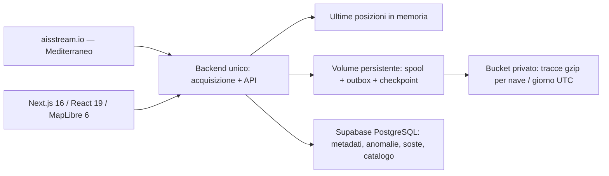

# AIS Vessel Tracker — beta Mediterraneo

Mappa pubblica senza account, ricerca MMSI/IMO/nome, schede nave, tracce fino a 90 giorni, soste rilevate e controlli OFAC/UE. Lo storico esiste soltanto per le osservazioni effettivamente ricevute; copertura, aggiornamento e interruzioni sono visibili.

**Stato:** [beta online per le verifiche](https://ais-vessel-tracker.vercel.app), con acquisizione AIS reale dal 6 ottobre 2026. Backup e ripristino cloud isolato sono stati provati. La qualificazione della release richiede ancora sette giorni sulla versione finale, tempi della manutenzione aggiornata, capacità del database e previsione di spesa. Misure e criteri aperti sono in [STATUS.md](docs/STATUS.md). I dati dimostrativi sono fittizi e non possono essere utilizzati in produzione.

## Avvio riproducibile

Richiesto Node.js 22 o successivo (consigliato 24 LTS). Installare entrambi i lockfile:

```sh
npm ci
npm --prefix frontend ci
npm run build
npm run build:frontend
```

Per provare l'interfaccia senza credenziali, in due terminali:

```sh
DEMO_MODE=true NODE_ENV=development ENV_FILE=/nonexistent STORAGE_DIR=./data/demo npm run dev:server
npm run dev:frontend
```

Aprire http://localhost:3000 e cercare MMSI `900000001`. La demo dichiara esplicitamente i dati fittizi; `/ready` risponde 503.

Per acquisire dati reali: copiare `.env.example` in `.env.local`, compilare i segreti backend e configurare il database seguendo [la procedura operativa](docs/OPERATIONS.md). Il frontend usa soltanto i due URL in `frontend/.env.example`. Avviare **un backend** con `npm run dev:server` e **un frontend** con `npm run dev:frontend`. In produzione usare `npm start` dopo `npm run build`.

## Architettura



- `server/`: processo unico, cache live, avvio, manutenzione e arresto.
- `ingestor/`: parser AIS classe A/B, riconnessione, anomalie sulle osservazioni live, algoritmo unico delle soste.
- `storage/`: coda persistente, archivio verificato e idempotente, backup/ripristino, accesso Supabase.
- `api/`: API, CORS esplicito, errori e controlli sanzioni.
- `shared/`: contratti, configurazione, campionamento e interruzioni.
- `frontend/`: mappa, ricerca cancellabile, schede SSR con cache di 60 secondi.
- `scripts/`: migrazioni additive e strumenti operativi.
- `tests/`: casi di guasto, PostgreSQL locale e browser desktop/telefono.

Nessun Redis, TimescaleDB o collegamento pubblico al database. Supabase conserva gli indici; le posizioni vengono archiviate nel bucket privato. Railway deve avere **una sola replica** e il volume montato su `/data`.

## Storico e attendibilità

| Età | Campionamento ordinario |
|---|---:|
| Ultime 48 ore | 1 minuto |
| 3–7 giorni | 5 minuti |
| 8–30 giorni | 30 minuti |
| 31–90 giorni | 2 ore |

Svolte, cambi di movimento/sosta, anomalie ed estremi dei vuoti mantengono punti aggiuntivi. La cache live accetta osservazioni ogni due secondi per nave; il campionamento dello storico non limita l'analisi delle anomalie.

Ogni ora: unione archivio/spool, compressione, caricamento e rilettura con checksum, aggiornamento catalogo, rimozione della sola parte archiviata. Ogni giorno alle 03:30 UTC: backup verificato, semplificazione e scadenza dei dati oltre 90 giorni. Gli oggetti citati dai backup degli ultimi sette giorni restano recuperabili. Se bucket o database falliscono, i dati già registrati restano sul volume. Il limite `STORAGE_MAX_BYTES`, massimo 4 GiB e da ridurre per volumi più piccoli, produce un errore esplicito e degrada il controllo operativo.

La mappa mostra le navi osservate negli ultimi dieci minuti. Una fonte senza nuove osservazioni per due minuti è segnalata come non aggiornata. Le linee si interrompono sui vuoti di osservazione; per i dati meno recenti si tiene conto dell'intervallo di campionamento. Le soglie sono in `shared/config.ts`.

Una sosta è rilevata dopo almeno 30 minuti entro 500 metri con velocità ≤1 nodo; termina in caso di spostamento, velocità maggiore o vuoto lungo. Le coordinate **non attestano l'esistenza di un porto**. Le anomalie sono indizi statistici, non prove di comportamenti illeciti. Destinazione ed ETA sono informazioni trasmesse dalla nave.

OFAC: navi nella SDN. UE: navi nell'Annex XLII del Regolamento 833/2014, con ambito dichiarato. Il download non valido conserva l'ultima lista valida; aggiornamento, fonte e indisponibilità del controllo sono distinti. Un fallimento del controllo non significa assenza di sanzioni.

## API

| Percorso GET | Risposta |
|---|---|
| `/health` | Processo attivo |
| `/ready` | Database, bucket, volume, connessione AIS e ultima osservazione; 503 se degradato |
| `/api/map/live?bbox=lonMin,latMin,lonMax,latMax` | `vessels`, conteggi, `truncated`, stato/freschezza fonte, inizio storico; massimo 5.000 |
| `/api/search?q=...` | MMSI/IMO esatti, similarità nome con pg_trgm |
| `/api/vessel/:mmsi` | Scheda, ultima posizione live, anomalie, stato/data/fonte controllo sanzioni |
| `/api/vessel/:mmsi/track?days=1\|7\|30\|90` | Elenco posizioni; massimo 5.000, inizio/fine conservati |
| `/api/vessel/:mmsi/track/metadata?days=...` | Finestra disponibile, intervalli, interruzioni, conteggi |
| `/api/vessel/:mmsi/portcalls` | Soste rilevate persistite |
| `/api/vessel/:mmsi/anomalies` | Tipo reale degli eventi |
| `/api/port/:lat,lon` | Soste nella località, con lo stesso algoritmo |
| `/admin/metrics` | Metriche operative; richiede Bearer ADMIN_TOKEN |

La traccia mantiene il contratto elenco; gli header `X-Track-*` aggiungono estremi, conteggio e campionamento. Se le sole interruzioni superano la capacità della risposta, l'API chiede di restringere la finestra (422). Gli errori delle dipendenze diventano 503; i risultati vuoti sono restituiti soltanto dopo una lettura riuscita. API pubbliche limitate a 120 richieste/minuto per IP.

**Coordinate diverse nei due contratti:** sottoscrizione AIS e `INGESTOR_BBOX` usano latitudine, longitudine; parametro mappa HTTP usa longitudine, latitudine. Nessun tentativo automatico di inversione.

## Verifiche

```sh
npm run verify
npm run lint
npm run build
npx playwright install chromium
npm run test:e2e
npm run test:load
```

I test PostgreSQL usano PGlite con pg_trgm e verificano migrazione ripetibile, dati legacy, similarità, sostituzione atomica e permessi anonimi. I test dell'archivio provocano upload/catalogo falliti, append concorrenti, riavvii, checksum non validi e ripristino su destinazione vuota. Le tracce sintetiche coprono 90 giorni. I test browser usano una demo separata e verificano l'intero percorso su desktop e telefono.

`npm run test:load` senza URL usa 5.000 navi sintetiche e 20 visitatori; non sostituisce la misura sul servizio remoto. Per dati AIS reali, con credenziali solo locali:

```sh
npx tsx scripts/verify-live.ts
```

La CI controlla ogni proposta di modifica, installa dai lockfile, compila e verifica UI/API. [OPERATIONS.md](docs/OPERATIONS.md) descrive staging, backup, ripristino, rollback e la soglia per l'apertura pubblica.

Licenza MIT.
